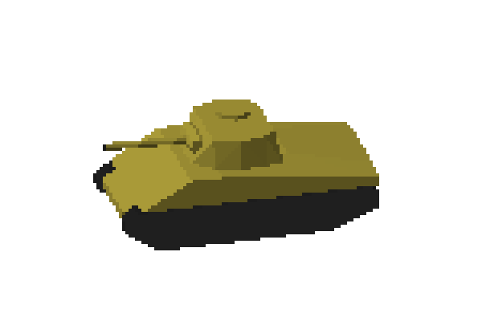

# Tiny Isomeric Renderer

Small script for rendering objects in orthographic projection in python and numpy.

## Examples:

[tank_desert_scene.webm](https://github.com/Pawix5k/tiny-isometric-renderer/assets/35242389/a0fd9dbb-980c-4f9a-8f22-301b1a9a4227)
